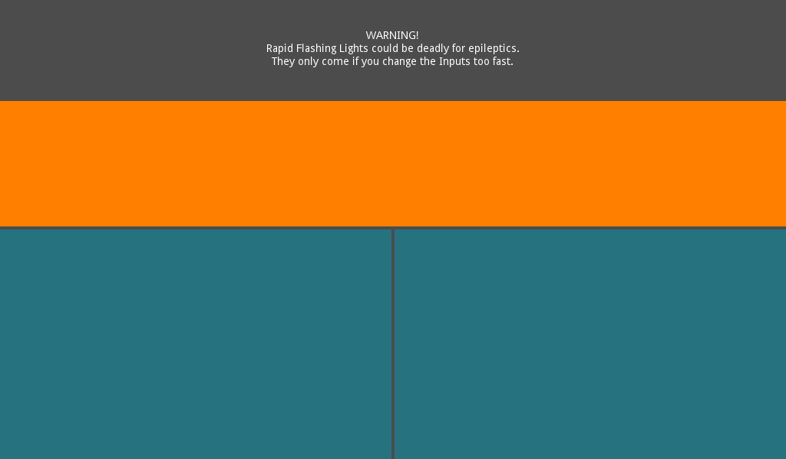
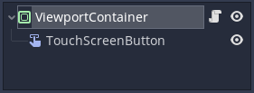

## Update: This repository is outdated

It's a really old solution which is absurdly complex compared to my new solution of simply using a _Button_ node instead.

To make the _Button_ behave like a 🎮Gamepad button, it should have this script with _on_button_down_ and _on_button_up_ signals for simulating the button press:

```
    extends Button
    
    func _on_button_down():
        Input.action_press("jump"); #Replace "jump" with your desired action
        
    func _on_button_up():
        Input.action_release("jump"); #Replace "jump" with your desired action
```

---

# Auto-scaling TouchScreenButton Demo for Godot



This Godot Project is dedicated to my solution on Dynamically resizing TouchScreenButtons, so that they're always the same relative size (e.g. a Half or Third of the Screen) instead of a unreliable Absolute Size,
which quickly fails as soon as the Screen is only slightly different in Size or Pixel Density.

---

I struggled with this for weeks, but Finally, I came to Exactly right idea on Exactly how to use Exactly working code to restrict the _TouchScreenButton_ to the area of a node, which DOES dynamically rescale how i want it to:
**Any _Control_ Node.**

 
 The Hierarchy of the TouchButton scene shows the _TouchScreenButton_ being a child of a _Control_ Node, which has this script to resize the _TouchScreenButton_ to the same size as the _Control_ Node:
 
	# This script is MIT-licensed # https://mit-license.org/ # ©2017-2020 Juan Linietski, Ariel Manzur & Godot Contributors
	extends Control
	
	export (String) var customAction = "ui_left"
	
	
	func _ready():
		$"TouchScreenButton".action = customAction
	
	
	func _process(_delta):
		# Dynamically resizes the Touch Buttons to the right size
		# if ,,HowManyTouchButtons" is set correctly:
		$"TouchScreenButton".shape.extents.x = $".".rect_size.x * 0.5
		$"TouchScreenButton".shape.extents.y = $".".rect_size.y * 0.5
		# This can safely be moved to the _ready() function
		# if the TouchScreenButtons will Only be displayed on Phones,
		# and that the app forces to be used in a specific screen orientation,
		# and that it can't be displayed in Split-Screen or Windowed mode
		# (Because these are the right conditions
		# for never needing to resize the Buttons during Runtime) )
	
	
	# fun_fact(0):
		# Did you know that TouchScreenButtons can exceed
		# the Boundaries of any Viewport,
		# and even creep into the Letterboxing and Pillarboxing of the game?)
		#
		# This was the problem I solved with this project,
		# but this property can also be abused
		# if you only have One Row of TouchButtons,
		# by letting them Scale Up Ridiculously Large (9999) into the Y-Axis,
		# but still constraining them in the X-Axis.
	
	# fun_fact(1):
		# I don't know why, but the Size Constraining only works
		# if I add a dividing operation
		# after setting the TouchScreenButton's Shape Extents.
		# So I did, but I framed it as a multiplying operation,
		# because Computers can multiply much faster than they can divide.

